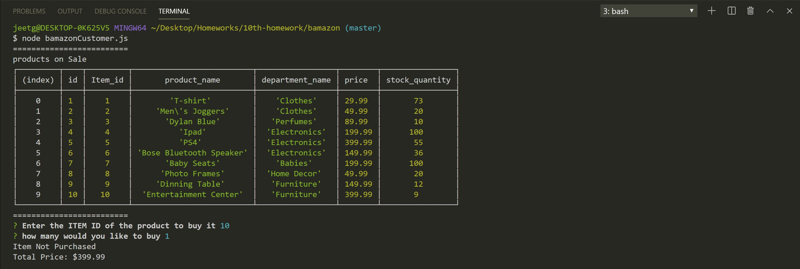
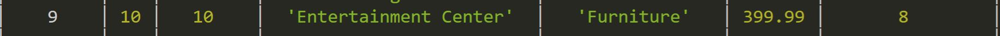
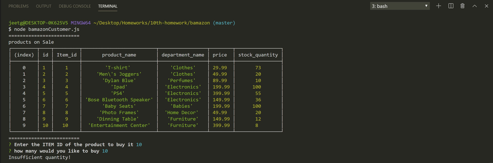

# BAMAZON HOMEWOK

#### Basic Assingment

This project was to create a MySql Database. The app takes in orders and updates it to the Database. 

### Notes given to us.

1. Creating the MySql Database called `bamazon`.

2. Create Table inside that database called `products`.

3. The `products` table should have each of the following columns:

    * item_id 

    * product_name 

    * department_name

    * price 
    
    * stock_quantity 

## My Basic Application ans the Images

#### data 1 Image

This image shows how is the database is working. Getting the data from the Database and showing that the item is purchased.

#### data 2 Image

After the database is complete, it will gave us the updated `stock_quantity`, which substracts from the quantity that a user inputed.

#### data 3 Image

This Image is showing that when a user inputs a value, that is more than the `stock_quantity`. It will console log that Insufficient Quantity.

# I still want to add some of the bonuses that our homework has. 